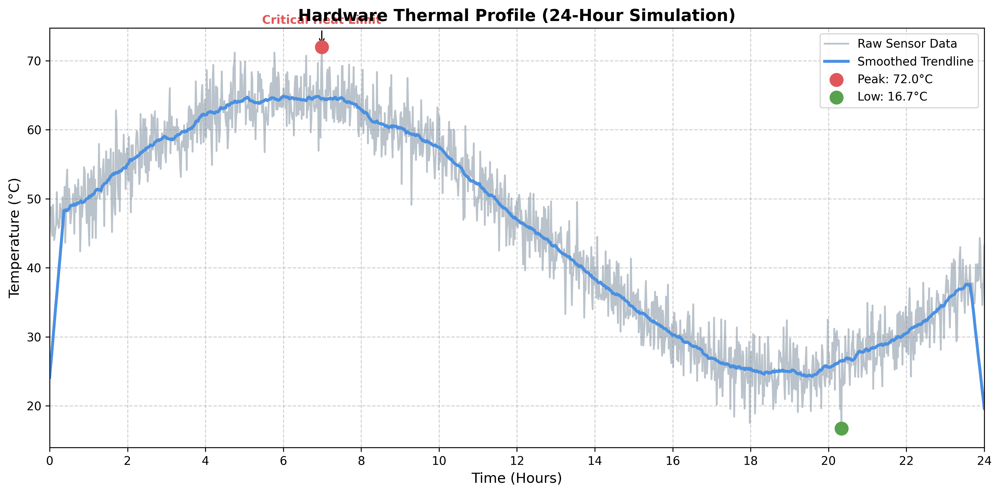

<div align="center">
  <h1>🚀 Python for Robotics: Foundation & Data Analytics</h1>
  <p style="font-size:1.05rem; color:#444; max-width:740px; margin:auto;">
    A polished portfolio of Python practice work from a 90-Day Robotics Challenge, built to showcase core algorithms, vectorized sensor processing, and engineering-grade data visualization.
  </p>
  <p>
    
    
    
    
  </p>
</div>

---

## 📌 Overview

This repository is a structured Python sandbox created during a 90-Day Robotics Challenge. It captures the progression from fundamental Python and OOP to advanced sensor data processing and engineering visualization for autonomous systems.

---

## 🗂️ Project Architecture

<details>
<summary><strong>Expand the file tree</strong></summary>

```text
python_practice/
│
├── 📁 Root/                            # Core Python Fundamentals
│   ├── Bank_account.py                 # OOP: Classes, Methods, State Management
│   ├── contact_CLI.py                  # File I/O & Persistent Data Storage
│   ├── student_topper_script.py        # Data Sorting & Lambda Functions
│   ├── FIZZBUZZ.py                     # Algorithmic Control Flow
│   └── (Calculater.py, Tip_Calculator.py, number_gussing.py, etc.)
│
├── 📁 numpy/                           # Vectorized Data Processing
│   ├── numpy_tutorial.py               # Arrays, Shapes, and Matrix Math
│   ├── excersice_1.py                  # 1D Autonomous Sensor Noise Filter
│   └── excersice_2.py                  # 2D Grid Occupancy Map (Broadcasting)
│
├── 📁 Matplotlib/                      # Data Visualization
│   ├── matplotlib_tutorial.py          # DataFrames, Bar Charts, and Pie Charts
│   ├── mat_excersice_1.py              # Ultrasonic Sensor Calibration Curve
│   ├── mat_excersice_2.py              # Transit Demand Dashboard (Subplots)
│   └── mat_excersice_3.py              # Autonomous Robot Trajectory Map
│
└── 📁 Num_Mat_excersice/               # 🏆 Capstone Project
    ├── Num_Mat_excersice.py            # 24-Hour Hardware Thermal Simulation
    └── thermal_profile_export.png      # High-Res Output Graphic
```

</details>

---

## 🚀 Core Modules & Progression

| Phase | Focus Area | Key Outcome |
|---|---|---|
| Phase 1 | Python Fundamentals & OOP | Built CLI persistence and object models for banking & contact management |
| Phase 2 | NumPy Vectorization | Developed sensor noise filters and occupancy grid math without loops |
| Phase 3 | Matplotlib Visualization | Produced engineering dashboards and trajectory analytics |
| Capstone | Thermal Simulation & Export | Simulated 24-hour thermal telemetry, smoothed noisy data, and exported a PNG dashboard |

---

## 📊 Capstone Highlight: Hardware Thermal Profile

This capstone is the visual signature of the repository. It combines NumPy-driven signal synthesis with Matplotlib dashboard construction to make thermal telemetry instantly interpretable.

- 1,440-minute baseline temperature profile using a sine wave model
- Gaussian noise injection with `np.random.normal` to mimic real sensor error
- Smoothed trendline via `np.convolve`
- Absolute max/min detection with `np.argmax`/`np.argmin`
- Exported as a presentation-ready PNG graphic

<div align="center">
  <a href="Num_Mat_excersice/thermal_profile_export.png" target="_blank">
    
  </a>
  <p style="font-size:0.95rem; color:#666; max-width:760px; margin:auto;">Embedded thermal profile dashboard generated by <code>Num_Mat_excersice/Num_Mat_excersice.py</code>.</p>
</div>

---

## ⚙️ How to Run

1. Clone the repository.
2. Install dependencies:
   ```bash
   pip install numpy matplotlib pandas
   ```
3. Run the capstone script:
   ```bash
   python "Num_Mat_excersice/Num_Mat_excersice.py"
   ```

---

## 💡 Why This Repository Matters

This repository is more than practice code; it is a curated trajectory from basic Python to robotics-aware data analysis. The files show how to move from syntax to sensor fusion, then into polished visual storytelling for engineering teams.

---

<p align="center">Designed and built by <strong>Rahul Choudhary</strong> as part of the journey to mastering autonomous systems.</p>
